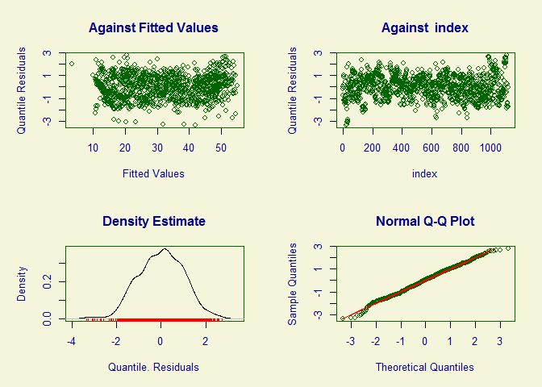
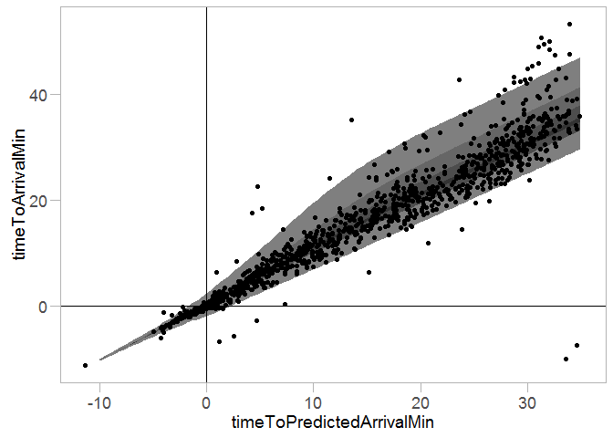
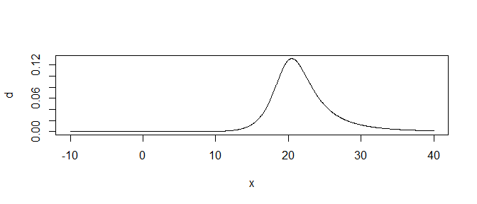
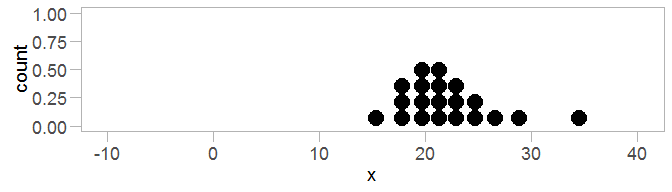

Example bus model
================

-   [Introduction](#introduction)
-   [Setup](#setup)
    -   [Required libraries](#required-libraries)
    -   [Ggplot theme](#ggplot-theme)
-   [Data](#data)
-   [Model](#model)
-   [Generating a predictive distribution for one bus](#generating-a-predictive-distribution-for-one-bus)

Introduction
------------

This document describes a simple probabilistic prediction model of bus arrival time used to generate realistic-looking predictions for the survey. While the model fits reasonably well to one bus from King County Metro, and served the purpose of giving predictive distributions for our survey, we do not recommend using this model unmodified in deployment. In particular, it is probably overfit to the couple of busses we tested it on.

Please cite:

Matthew Kay, Tara Kola, Jessica Hullman, Sean Munson. *When (ish) is My Bus? User-centered Visualizations of Uncertainty in Everyday, Mobile Predictive Systems*. CHI 2016. DOI: [10.1145/2858036.2858558](http://dx.doi.org/10.1145/2858036.2858558).

Setup
-----

### Required libraries

If you are missing any of the packages below, use `install.packages("packagename")` to install them. The `import::` syntax requires the `import` package to be installed, and provides a simple way to import specific functions from a package without polluting your entire namespace (unlike `library()`)

``` r
library(ggplot2)
import::from(gamlss, gamlss, predictAll)
import::from(gamlss.dist, BCTo, dBCTo, pBCTo, qBCTo)
import::from(magrittr, `%>%`, `%<>%`, `%$%`)
import::from(dplyr, 
    transmute, group_by, mutate, filter, select, data_frame,
    left_join, summarise, one_of, arrange, do, ungroup)
```

### Ggplot theme

``` r
theme_set(theme_light() + theme(
    panel.grid.major=element_blank(), 
    panel.grid.minor=element_blank(),
    axis.line=element_line(color="black"),
    text=element_text(size=14),
    axis.text=element_text(size=rel(15/16)),
    axis.ticks.length=unit(8, "points"),
    line=element_line(size=.75)
))
```

Data
----

Let's load historical data from one bus:

``` r
df = read.csv("data/bus-history-44.csv")
```

We're particularly interested in just a few columns from this table:

``` r
df %>%
    select(
        timeToArrivalMin, timeToPredictedArrivalMin,
        timeSinceLastUpdateMin, timeToScheduledArrivalMin,
        predictedArrivalDelayMin
    ) %>%
    head(10)
```

    ##    timeToArrivalMin timeToPredictedArrivalMin timeSinceLastUpdateMin
    ## 1         22.979333                 23.962667              1.2540000
    ## 2          9.377333                  8.727333              1.1726667
    ## 3          7.866233                  7.016233              1.4504333
    ## 4          6.857883                  5.291217              1.0587833
    ## 5          5.849517                  4.282850              2.0671500
    ## 6          2.317933                  1.434600              1.1487333
    ## 7         -2.725183                 -2.725183              1.6918500
    ## 8         -3.733800                 -3.733800              2.7004667
    ## 9         22.166650                 24.341650              0.9750167
    ## 10        20.149450                 22.024450              0.7422167
    ##    timeToScheduledArrivalMin predictedArrivalDelayMin
    ## 1                  22.812667                1.1500000
    ## 2                   9.210667               -0.4833333
    ## 3                   7.699567               -0.6833333
    ## 4                   6.691217               -1.4000000
    ## 5                   5.682850               -1.4000000
    ## 6                   2.151267               -0.7166667
    ## 7                  -2.891850                0.1666667
    ## 8                  -3.900467                0.1666667
    ## 9                  22.258317                2.0833333
    ## 10                 20.241117                1.7833333

These give the actual time to arrival from when the reading was taken, the time to arrival predicted by OneBusAway at that moment, the time since the last update, the time until the bus is scheduled to arrive, and the predicted delay (predicted minus scheduled arrival time).

Model
-----

We want to predict the time to arrival based on the other four columns. Below is a Box-Cox t (BCT) regression that does so (strictly speaking, a *shifted* Box-Cox t; the various `+ 15`s and `- 15`s used throughout this document shift the BCT distribution to be defined on `(-15, Inf)` instead of its usual `(0, Inf)`):

``` r
m = gamlss(
    I(timeToArrivalMin + 15) ~ log(timeToPredictedArrivalMin + 15) + timeSinceLastUpdateMin,
    sigma.formula = ~ log(timeToPredictedArrivalMin + 15),
    nu.formula =  ~ I(log(predictedArrivalDelayMin + 15) - log(timeToPredictedArrivalMin + 15)),
    tau.formula =  ~ log(timeToPredictedArrivalMin + 15),
    data=df,
    n.cyc=50,
    family=BCTo)
```

Here are some model diagnostics for this model:

``` r
plot(m)
```



    ## *******************************************************************
    ##        Summary of the Quantile Residuals
    ##                            mean   =  -0.002351694 
    ##                        variance   =  1.016349 
    ##                coef. of skewness  =  -0.1163822 
    ##                coef. of kurtosis  =  2.881981 
    ## Filliben correlation coefficient  =  0.9982402 
    ## *******************************************************************

It doesn't look *too* bad, at least as a description of this particular bus (though it is probably overfit and could do with regularization, but for the purposes of our survey this is not a concern).

The fitted model against the data looks like this:

``` r
predictions = 
    data_frame(
        timeToPredictedArrivalMin = seq(-10, 35, length.out = 100),
        timeSinceLastUpdateMin = mean(df$timeSinceLastUpdateMin),
        predictedArrivalDelayMin = mean(df$predictedArrivalDelayMin),
        timeToScheduledArrivalMin = timeToPredictedArrivalMin + predictedArrivalDelayMin
    ) %>%
    cbind(predictAll(m, newdata = ., data = df)) %>%
    mutate(
        upper95 = qBCTo(.975, mu, sigma, nu, tau) - 15,
        lower95 = qBCTo(.025, mu, sigma, nu, tau) - 15,
        upper80 = qBCTo(.9, mu, sigma, nu, tau) - 15,
        lower80 = qBCTo(.1, mu, sigma, nu, tau) - 15,
        upper50 = qBCTo(.75, mu, sigma, nu, tau) - 15,
        lower50 = qBCTo(.25, mu, sigma, nu, tau) - 15,
        upper10 = qBCTo(.55, mu, sigma, nu, tau) - 15,
        lower10 = qBCTo(.45, mu, sigma, nu, tau) - 15
    )

predictions %>%
    ggplot(aes(x = timeToPredictedArrivalMin)) +
    geom_ribbon(aes(ymin = lower95, ymax = upper95), fill="gray50") +
    geom_ribbon(aes(ymin = lower50, ymax = upper80), fill="gray40") +
    geom_ribbon(aes(ymin = lower50, ymax = upper50), fill="gray30") +
    geom_ribbon(aes(ymin = lower10, ymax = upper10), fill="gray20") +
    geom_point(aes(y = timeToArrivalMin), data = df) +
    geom_vline(xintercept = 0) +
    geom_hline(yintercept = 0)
```



Not completely terrible.

Generating a predictive distribution for one bus
------------------------------------------------

Given the model and the observations of the current point prediction from OneBusAway for a single bus, we can generate a predictive distribution based on that point:

``` r
one_bus = data_frame(
        #observations presumed to come from OneBusAway:
        timeToPredictedArrivalMin = 20,
        timeSinceLastUpdateMin = 1,
        predictedArrivalDelayMin = 5,
        timeToScheduledArrivalMin = timeToPredictedArrivalMin + predictedArrivalDelayMin
    ) %>%
    cbind(predictAll(m, newdata = ., data = df))
```

The prediction yields parameters of a Box-Cox t distribution, `mu`, `sigma`, `nu`, and `tau`:

``` r
t(one_bus)
```

    ##                                [,1]
    ## timeToPredictedArrivalMin 20.000000
    ## timeSinceLastUpdateMin     1.000000
    ## predictedArrivalDelayMin   5.000000
    ## timeToScheduledArrivalMin 25.000000
    ## mu                        37.508948
    ## sigma                      0.124955
    ## nu                        -8.419721
    ## tau                        2.068745

These parameters define a probability distribution that we can plot, for example as a density plot:

``` r
one_bus %$% curve(dBCTo(x + 15, mu, sigma, nu, tau), n = 1001, xlim = c(-10, 40), ylab="d")
```



Or as a quantile dotplot:

``` r
one_bus %$%
    data_frame(x = qBCTo(ppoints(20), mu, sigma, nu, tau) - 15) %>%
    ggplot(aes(x = x)) +
    geom_dotplot(binwidth = 1.5) +
    xlim(-10, 40)
```


