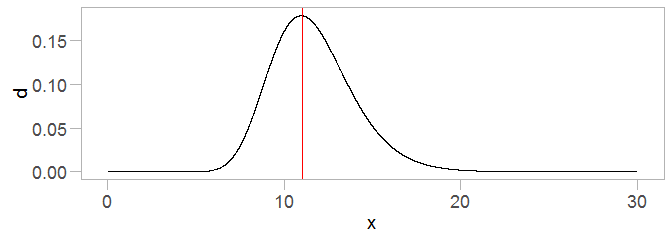
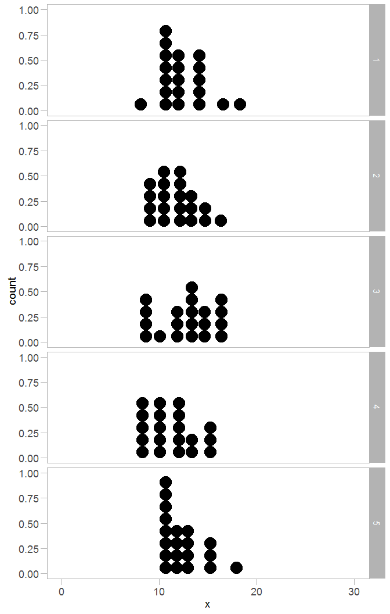
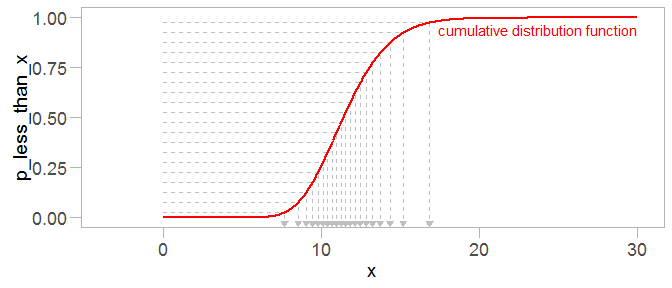
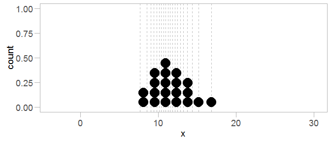
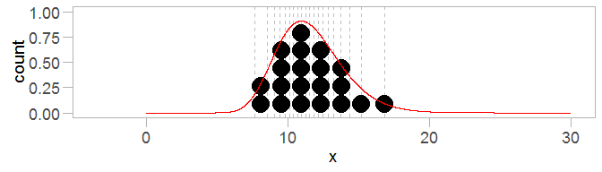
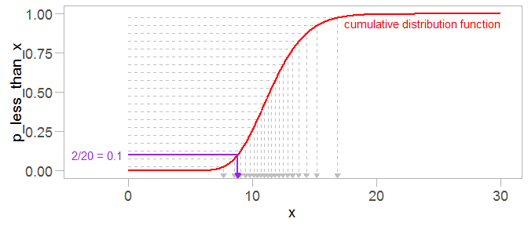
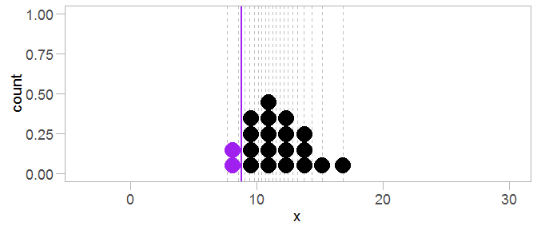

Quantile dotplots
================

-   [Introduction](#introduction)
-   [Setup](#setup)
    -   [Required libraries](#required-libraries)
    -   [Ggplot theme](#ggplot-theme)
-   [Representing a continuous probability distribution as discrete outcomes](#representing-a-continuous-probability-distribution-as-discrete-outcomes)
    -   [A problematic solution: random draws](#a-problematic-solution-random-draws)
    -   [A consistent solution: a quantile dotplot](#a-consistent-solution-a-quantile-dotplot)
-   [Properties of the quantile dotplot](#properties-of-the-quantile-dotplot)
    -   [Shape approximates density](#shape-approximates-density)
    -   [Finding probability intervals reduces to counting](#finding-probability-intervals-reduces-to-counting)

Introduction
------------

This document describes *quantile dotplots*, the basic motivation behind them, and how to generate them.

Please cite:

Matthew Kay, Tara Kola, Jessica Hullman, Sean Munson. *When (ish) is My Bus? User-centered Visualizations of Uncertainty in Everyday, Mobile Predictive Systems*. CHI 2016. DOI: [10.1145/2858036.2858558](http://dx.doi.org/10.1145/2858036.2858558).

Setup
-----

### Required libraries

If you are missing any of the packages below, use `install.packages("packagename")` to install them. The `import::` syntax requires the `import` package to be installed, and provides a simple way to import specific functions from a package without polluting your entire namespace (unlike `library()`)

``` r
library(ggplot2)
import::from(magrittr, `%>%`, `%<>%`, `%$%`)
import::from(dplyr, 
    transmute, group_by, mutate, filter, select, data_frame,
    left_join, summarise, one_of, arrange, do, ungroup)
```

### Ggplot theme

``` r
theme_set(theme_light() + theme(
    panel.grid.major=element_blank(), 
    panel.grid.minor=element_blank(),
    axis.line=element_line(color="black"),
    text=element_text(size=14),
    axis.text=element_text(size=rel(15/16)),
    axis.ticks.length=unit(8, "points"),
    line=element_line(size=.75)
))
```

Representing a continuous probability distribution as discrete outcomes
-----------------------------------------------------------------------

We might like to represent a continuous probability distribution (say, a prediction for when a bus is going to arrive) as discrete outcomes, since frequency-based (or "discrete outcome") presentations can be easier for people to interpret. How should we do that?

### A problematic solution: random draws

A first pass at representing a continous probability distribution as discrete outcomes might be to generate random draws from that distribution. However, especially for a small number of samples, this tends not to work well. The problem is that any given random sample of (say) 20 isn't always representative.

For example, a log-normal distribution might look like this:

``` r
mu = log(11.4)
sigma = 0.2
x = seq(from=.01, to=30, length=10001)
d = dlnorm(x, mu, sigma)
density_df = data_frame(x, d)
density_df %>%
    ggplot(aes(x = x, y = d)) +
    geom_line() +
    geom_vline(xintercept = 11, color="red") + 
    xlim(0, 30)
```



And we could generate random samples of a set size, say 20, to visualize this. But every time we do that it looks different:

``` r
runs = 5
samples = 20
binwidth = 1.25
data.frame(
    run = factor(1:runs),
    x = rlnorm(runs * samples, mu, sigma)
) %>%
    ggplot(aes(x=x)) +
        geom_dotplot(binwidth=binwidth) +
        facet_grid(run ~ .) +
        xlim(0, 30)
```



Sometimes the distribution shape is obscured, the location shifted, or tails over- or under-represented.

### A consistent solution: a quantile dotplot

One way to get a more consistent representation is to use the quantile function of the distribution instead of random draws. In essence, this encodes the cumulative distribution function one-dimensionally, and then turns it into a Wilkinsonian dotplot. (Wilkinson originally described dotplots for displaying sample data in [Wilkinson, L, Dot Plots, *The American Statistician*, 1999](dx.doi.org/10.1080/00031305.1999.10474474); we re-use them here for displaying predictive quantiles, hence *quantile dotplot*).

First, we generate evenly-space quantiles in probability space (i.e. from 0 to 1) depending on the number of `samples` we want. If you are familiar with Q-Q plots, this is essentially the same approach used to generate representative quantiles for a Q-Q plot (a variant of this method is implemented in R in the `ppoints` function, but spelled out here for completeness).

``` r
quantiles = data_frame(
    p_less_than_x = seq(from = 1/samples / 2, to = 1 - (1/samples / 2), length=samples),
    x = qlnorm(p_less_than_x, mu, sigma)
)
quantiles
```

    ## # A tibble: 20 x 2
    ##    p_less_than_x         x
    ##            <dbl>     <dbl>
    ## 1          0.025  7.703082
    ## 2          0.075  8.548083
    ## 3          0.125  9.057050
    ## 4          0.175  9.456435
    ## 5          0.225  9.801450
    ## 6          0.275 10.115423
    ## 7          0.325 10.410979
    ## 8          0.375 10.696167
    ## 9          0.425 10.976863
    ## 10         0.475 11.257921
    ## 11         0.525 11.543872
    ## 12         0.575 11.839448
    ## 13         0.625 12.150147
    ## 14         0.675 12.482976
    ## 15         0.725 12.847707
    ## 16         0.775 13.259262
    ## 17         0.825 13.743022
    ## 18         0.875 14.349043
    ## 19         0.925 15.203409
    ## 20         0.975 16.871168

The table above shows the probability of drawing a value less than x (i.e. `P(X < x)`) and the corresponding value of x to achieve that probability on the underlying distribution. We generate 20 (or whatever value of `samples` you like) values of `p_less_than_x` evenly-spaced in `(0,1)` (i.e. not including 0 or 1), and then find `x` using the inverse CDF (aka the quantile function) of the predictive distribution at each value of `p_less_than_x`. If we then take those values of `x` and plot them as a dotplot, we get a quantile dotplot:

Visualized with the CDF, that looks like this:

``` r
x = seq(0.01, 30, length=1001)
p_less_than_x = plnorm(x, mu, sigma)
qf_df = data_frame(x, p_less_than_x)
cdf_plot = ggplot(quantiles, aes(x=x, y=p_less_than_x)) +
    geom_segment(aes(xend=x, yend=p_less_than_x), x = 0, color="gray75", linetype="dashed") +
    geom_segment(aes(xend=x, yend=p_less_than_x), y = -0.05, color="gray75", linetype="dashed",
        arrow = arrow(ends="first", length=unit(5, "pt"), type="closed")) +    
    geom_line(data = qf_df, color="red", size=1) +
    annotate("text", x = 30, y = 1, label = "cumulative distribution function", color="red", hjust=1, vjust=1.5) +
    xlim(c(-3.5, 30))
cdf_plot

quantile_dotplot = quantiles %>%
    ggplot(aes(x = x)) +
    geom_vline(aes(xintercept = x), color="gray75", linetype="dashed") +  
    geom_dotplot(binwidth = 1.25, color=NA) +
    xlim(-3.5,30)
quantile_dotplot
```



The evenly-spaced probabilities on the y axis are turned into representative quantiles from the distribution on the x axis.

Properties of the quantile dotplot
----------------------------------

### Shape approximates density

The shape a quantile dotplot approximates the shape of the density:

``` r
quantile_dotplot +
    geom_line(aes(y = d * 5.1), data = density_df, color="red")
```



### Finding probability intervals reduces to counting

Inferences about one-sided probability intervals on the distribution can be made through counting. If our example distribution represents a probability distribution over predicted time to arrive for my bus, and I am willing to miss the bus 2/20 times, I can count up 2 dots ("busses") from the left to get the time I should arrive at the bus stop. This works because the x-value for `P(X < x) = 2/20` will be between the second and third dot. More generally, the x-value for `P(X < x) = k/20` will be between the `k`th and `k + 1`th dot). Here's how this works on the CDF and the dotplot:

``` r
cdf_plot +
    geom_segment(x = 0, xend = qlnorm(.1, mu, sigma), y = .1, yend = .1, color = "purple", size = 1) +  
    geom_segment(x = qlnorm(.1, mu, sigma), xend = qlnorm(.1, mu, sigma), y = -0.05, yend = .1, 
        color = "purple", size = 1, arrow = arrow(ends="first", length=unit(5, "pt"), type="closed")) +
    annotate("text", x = 0, y = 0.1, label = "2/20 = 0.1", color = "purple", hjust = 1.1)
quantile_dotplot +
    geom_dotplot(binwidth = 1.25, color=NA, fill="purple", data=filter(quantiles, p_less_than_x < .1)) +
    geom_vline(xintercept = qlnorm(.1, mu, sigma), color="purple", size=1) 
```



Consequently, this purple line represents the point of time I should arrive at my bus if I want to catch it about 18 times out of 20 (or miss it 2 times out of 20).
