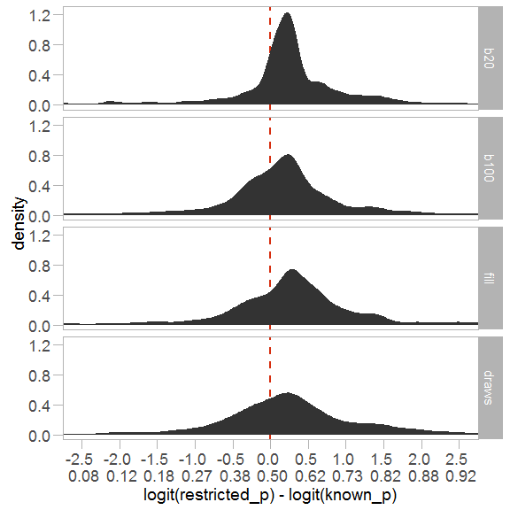
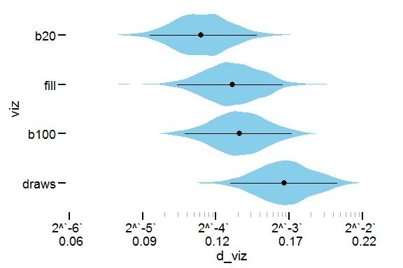
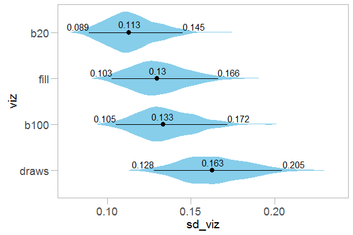
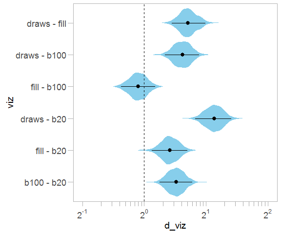
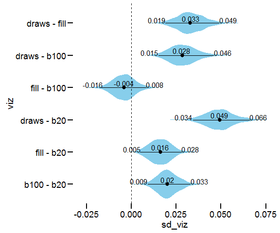
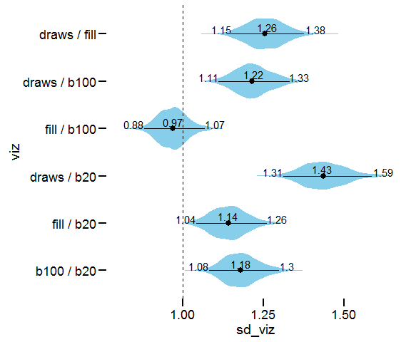
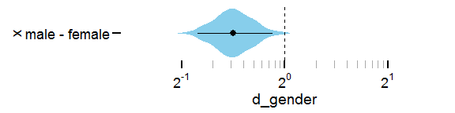
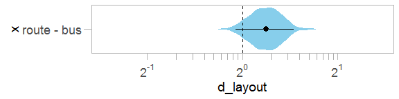

Survey analysis for When (ish) is My Bus? User-centered Visualizations of Uncertainty in Everyday, Mobile Predictive Systems
================

-   [Introduction](#introduction)
-   [Setup](#setup)
    -   [Required libraries](#required-libraries)
-   [Load and clean data](#load-and-clean-data)
-   [Method](#method)
-   [Results](#results)
    -   [Variance in respondents' probability estimates](#variance-in-respondents-probability-estimates)
    -   [Beta regression model](#beta-regression-model)
    -   [Confidence](#confidence)

Introduction
------------

This document describes the analyses from our paper using R code and associated output. It is generated from [survey\_analysis.Rmd](survey_analysis.Rmd).

Setup
-----

### Required libraries

If you are missing any of the packages below, use `install.packages("packagename")` to install them. The `import::` syntax requires the `import` package to be installed, and provides a simple way to import specific functions from a package without polluting your entire namespace (unlike `library()`)

``` r
library(Hmisc)
library(ggplot2)
import::from(scales, extended_breaks, format_format, math_format)
import::from(boot, logit, inv.logit)
import::from(grid, grid.draw)
import::from(RVAideMemoire, spearman.ci)
import::from(magrittr, `%>%`, `%<>%`, `%$%`)
import::from(dplyr, 
    transmute, group_by, mutate, filter, select, 
    left_join, summarise, one_of, arrange, do, ungroup)
import::from(gamlss, gamlss)
import::from(gamlss.dist, BE)
```

We also use the following libraries available from Github, which can be installed using `devtools::install_github`:

``` r
library(tidybayes)      # compose_data, apply_prototypes, extract_samples, compare_levels
                        # to install, run devtools::install_github("mjskay/tidybayes")
library(metabayes)      # metastan
                        # to install, run devtools::install_github("mjskay/metabayes")
```

Set up a decent ggplot theme for use in papers:

Finally, some of the manipulation of Bayesian model posteriors can take a bunch of memory:

``` r
memory.limit(10000)
```

Load and clean data
-------------------

Data loading and cleaning is implemented in [R/load-survey-data.R](R/load-survey-data.R), which loads and defines a few data frames, notably `df` (raw data) and `dfl` (`df` transformed and cleaned up into long format).

``` r
source("R/load-survey-data.R")
```

Since most of our analysis will be done with `dfl`, let's see its structure:

``` r
str(dfl)
```

    ## 'data.frame':    4328 obs. of  40 variables:
    ##  $ participant                    : Factor w/ 541 levels "147","148","149",..: 1 1 1 1 1 1 1 1 2 2 ...
    ##  $ link_name                      : Factor w/ 5 levels "DUB/Lab email lists",..: 5 5 5 5 5 5 5 5 5 5 ...
    ##  $ mturk                          : logi  FALSE FALSE FALSE FALSE FALSE FALSE ...
    ##  $ layout                         : Factor w/ 2 levels "Bus-Density",..: 1 1 1 1 1 1 1 1 1 1 ...
    ##  $ scenario_1_viz                 : Factor w/ 4 levels "b100","b20","draws",..: 2 2 2 2 2 2 2 2 1 1 ...
    ##  $ scenario_2_viz                 : Factor w/ 4 levels "b100","b20","draws",..: 3 3 3 3 3 3 3 3 4 4 ...
    ##  $ scenario_3_viz                 : Factor w/ 4 levels "b100","b20","draws",..: 4 4 4 4 4 4 4 4 2 2 ...
    ##  $ scenario_4_viz                 : Factor w/ 4 levels "b100","b20","draws",..: 1 1 1 1 1 1 1 1 3 3 ...
    ##  $ Random.first.scenario          : int  4 4 4 4 4 4 4 4 2 2 ...
    ##  $ Random.first.scenario.type     : Factor w/ 4 levels "b100","b20","draws",..: 1 1 1 1 1 1 1 1 4 4 ...
    ##  $ used_onebusaway_before         : Factor w/ 2 levels "No","Yes": 2 2 2 2 2 2 2 2 2 2 ...
    ##  $ onebusaway_use_frequency       : Factor w/ 4 levels "Less than once a month",..: 3 3 3 3 3 3 3 3 2 2 ...
    ##  $ onebusaway_inaccurate_frequency: Factor w/ 5 levels "Less than once a month",..: 3 3 3 3 3 3 3 3 3 3 ...
    ##  $ onebusaway_trust               : int  73 73 73 73 73 73 73 73 62 62 ...
    ##  $ get_coffee                     : logi  TRUE TRUE TRUE TRUE TRUE TRUE ...
    ##  $ gender                         : Factor w/ 2 levels "Female","Male": 2 2 2 2 2 2 2 2 2 2 ...
    ##  $ age                            : int  NA NA NA NA NA NA NA NA 25 25 ...
    ##  $ occupation                     : Factor w/ 46 levels "Accounting","Accounting / Finance / Banking",..: 41 41 41 41 41 41 41 41 43 43 ...
    ##  $ education                      : Factor w/ 6 levels "12th grade or less",..: 5 5 5 5 5 5 5 5 5 5 ...
    ##  $ statistics_experience          : Ord.factor w/ 4 levels "Never studied it"<..: 3 3 3 3 3 3 3 3 4 4 ...
    ##  $ risk_averse_1                  : int  7 7 7 7 7 7 7 7 2 2 ...
    ##  $ risk_averse_2                  : int  2 2 2 2 2 2 2 2 2 2 ...
    ##  $ risk_averse_3                  : int  4 4 4 4 4 4 4 4 2 2 ...
    ##  $ risk_averse_4                  : int  4 4 4 4 4 4 4 4 2 2 ...
    ##  $ risk_averse_5                  : int  -1 -1 -1 -1 -1 -1 -1 -1 -5 -5 ...
    ##  $ risk_averse_6                  : int  4 4 4 4 4 4 4 4 1 1 ...
    ##  $ risk_averse                    : num  20 20 20 20 20 20 20 20 4 4 ...
    ##  $ statistics_experience_coding   : num  0.167 0.167 0.167 0.167 0.167 ...
    ##  $ scenario                       : Factor w/ 4 levels "scenario_1","scenario_2",..: 1 1 2 2 3 3 4 4 1 1 ...
    ##  $ pquestion                      : Factor w/ 8 levels "scenario_1_lt10",..: 1 2 3 4 5 6 7 8 1 2 ...
    ##  $ confidence                     : num  0.85 0.99 0.44 0.99 0.7 0.79 0.79 0.56 0.84 0.59 ...
    ##  $ p                              : num  0.46 0.83 0.7 0.88 0.45 0.75 0.06 0.8 0.5 0.23 ...
    ##  $ viz                            : Factor w/ 4 levels "b20","b100","fill",..: 1 1 4 4 3 3 2 2 2 2 ...
    ##  $ ease_of_use                    : num  1 1 0.41 0.41 0.62 0.62 0.76 0.76 0.85 0.85 ...
    ##  $ visual_appeal                  : num  0.5 0.5 0.92 0.92 0.72 0.72 0.85 0.85 0.46 0.46 ...
    ##  $ known_p                        : num  0.427 0.82 0.196 0.883 0.56 ...
    ##  $ restricted_p                   : num  0.46 0.83 0.7 0.88 0.45 0.75 0.06 0.8 0.5 0.23 ...
    ##  $ restricted_confidence          : num  0.85 0.99 0.44 0.99 0.7 0.79 0.79 0.56 0.84 0.59 ...
    ##  $ restricted_ease_of_use         : num  0.999 0.999 0.41 0.41 0.62 0.62 0.76 0.76 0.85 0.85 ...
    ##  $ restricted_visual_appeal       : num  0.5 0.5 0.92 0.92 0.72 0.72 0.85 0.85 0.46 0.46 ...

In most cases we'll be particularly interested in just a few columns, so let's see those:

``` r
dfl %>%
    select(participant, viz, known_p, p, restricted_p) %>%
    head(10)
```

    ##    participant   viz    known_p    p restricted_p
    ## 1          147   b20 0.42709970 0.46         0.46
    ## 2          147   b20 0.81988740 0.83         0.83
    ## 3          147 draws 0.19591540 0.70         0.70
    ## 4          147 draws 0.88280490 0.88         0.88
    ## 5          147  fill 0.56022660 0.45         0.45
    ## 6          147  fill 0.67924810 0.75         0.75
    ## 7          147  b100 0.08133955 0.06         0.06
    ## 8          147  b100 0.69375010 0.80         0.80
    ## 9          148  b100 0.42709970 0.50         0.50
    ## 10         148  b100 0.81988740 0.23         0.23

`participant` is a factor corresponding to the participant, `viz` is a factor corresponding to the visualization (`b20` is dotplot-20, `b100` is dotplot-100, `draws` is the stripeplot, and `fill` is the density plot), `known_p` is the true probability being estimated, `p` is the participant's estimate, and `restricted_p` is the same as `p` except `0` is mapped to `0.001` and `1` is mapped to `0.999`, because the regression model we will use requires outcomes between 0 and 1 (exclusive).

Method
------

To assess the bias and variance in responses more systematically, we fit a beta regression to participants' estimated probabilities. Beta regression assumes responses are distributed according to a beta distribution, which is defined on (0, 1) and naturally accounts for the fact that responses on a bounded interval have non-constant variance (also known as *hetereoskedasticity*): as we approach the boundaries, responses tend to "bunch up".

We use a regression with a submodel for the mean (in logit-space) and the dispersion (in log-space). This allows us to model the *bias* of people's estimates as effects on the mean of their responses, and the *variance* of their estimates as effects on the dispersion of their responses. Specifically, we include *visualization*, *logit(correct probability)*, and their interaction as fixed effects on mean response (we use logit(correct probability) instead of the untransformed correct probability because the response is also estimated in logit space, thus an unbiased observer would have an intercept of 0 and slope of 1 for logit(correct probability)). We include *visualization* and *layout* as fixed effects on the dispersion (in other words, some visualizations or layouts may be harder to use, resulting in more variable responses). We also include *participant* and *participant × visualization* as random effects (some people may be worse at this task, or worse at this task on specific visualizations), and *question* as a random effect (some questions may be harder).

We use a Bayesian model, which allows us to build on previous results by specifying prior information for effects. We derive prior effects from fitting a similar model to the data from Hullman et al., which had a similar task (estimating cumulative probabilities on three visualizations: a violin plot, animated hypothetical outcomes, and error bars). We set Gaussian priors for fixed effects in our model that capture the sizes of effects seen in the HOPs data within 1-2 standard deviations, with skeptical means (0 for intercept and 1 for slope in logit-logit space, corresponding to an unbiased observer). We use the posterior estimate of the variance of the random effect of participant in that model as the prior for the variance of random effects in our analysis. (Footnote: note that similar results were obtained using more default priors, showing our results are not highly sensitive to choice of priors here).

Results
-------

### Variance in respondents' probability estimates

As a first glance at understanding performance across conditions, we can look at differences between the correct probability and the probability respondents gave for each questions (in logit-logit space). Here is the density of those differences, broken down by *visualization type*:

``` r
dfl %>%
    ggplot(aes(x = logit(restricted_p) - logit(known_p))) + 
    geom_vline(xintercept=0, linetype="dashed", color="#d62d0e", size=.75) +
    stat_density() +
    scale_x_continuous(breaks=extended_breaks(11), 
        labels = function(x) paste(format_format()(x), "\n", format_format()(round(inv.logit(x),2)))) +
    coord_cartesian(xlim=c(-2.5,2.5)) + 
    facet_grid(viz~.)
```



We can see that bias (the difference between the provided answer and the correct answer on average) is fairly low. Visually, we can also see that variance in the estimates appears lower in the *dotplot-20* visualization compared to the other visualizations.

### Beta regression model

Because the Bayesian model can take a little while to fit, the code for specifying and fitting the model can be found in [R/beta-regression-for-p~known\_p.R](R/beta-regression-for-p~known_p.R), which saves its output to the `fit` object stored in [fits/fit-p~known\_p.RData](fits/fit-p~known_p.RData).

``` r
load("fits/fit-p~known_p.RData")
```

Since Stan doesn't know anything about factors, we use `apply_prototypes` to recover information like what indices correspond to which factors (e.g., vizualization types) in the model. This allows the `tidy_samples` function to correctly label coefficients when it extracts them from the model.

``` r
fit %<>% apply_prototypes(dfl)
```

Using the beta regression model described above, we can estimate the dispersion associated with each visualization. First, we extract the dispersion coefficients from the model:

``` r
dispersion = tidy_samples(fit, d_viz[viz])
```

Then we'll set up some function for plotting:

``` r
#assuming data in natural log space, these give log2 breaks and log2 labels
log2_breaks = function(x) extended_breaks()(x/log(2)) * log(2)
log2_format = function(x) math_format(2^.x)(x/log(2))

#assuming dispersion coefficients in log space, this gives approximate standard deviation
#of a beta distribution with mean .5 having that dispersion
logdisp_to_sd.5 = function(x) sqrt(.25/(exp(-x) + 1))
logdisp_to_sd.5_format = function(x) format_format()(round(sqrt(.25/(exp(-x) + 1)), 2))

no_clip = function(p) {
    #draw plot with no clipping
    gt = ggplot_gtable(ggplot_build(p))
    gt$layout$clip[gt$layout$name=="panel"] = "off"
    grid.draw(gt)
}

logticks = function(x, base=2) {
    #hackish logticks since ggplot's are broken with coord_flip
    min_ = min(ceiling(x/log(base)))
    max_ = max(floor(x/log(base))) - 1
    data.frame(tick = unlist(lapply(min_:max_, function(x) {
        log10(1:10*10^x)*log(base)
    })))
}
```

And we'll plot the dispersion coefficients:

``` r
#as dispersion
p = dispersion %>%
    mutate(viz = reorder(viz, -d_viz)) %>%   #nicer order for this plot
    ggeye(aes(x = viz, y = d_viz)) + 
    geom_segment(aes(y=tick, yend=tick), data=logticks(dispersion$d_viz), 
        x=.3, xend=.4, color="darkgray"
    ) +
    scale_y_continuous(
        breaks = log2_breaks,
        labels = function(x) paste(log2_format(x), "\n", logdisp_to_sd.5_format(x))
    ) 
no_clip(p)
```



*Dotplot-20* has the lowest estimated dispersion. However, these are a little difficult to interpret. So instead, we'll convert the dispersion into the predicted standard deviation of the response assuming the mean predicted response (`p`) is == .5:

``` r
#as sd at p = .5
dispersion %>%
    mutate(
        viz = reorder(viz, -d_viz), #nicer order for this plot
        sd_viz = logdisp_to_sd.5(d_viz)
    ) %>%
    ggeye(aes(x = viz, y = sd_viz)) + 
    stat_summary(aes(label=..y..), fun.y = function(x) 
        round(quantile(x, .025), 3), geom="text", vjust=-0.3, hjust=1, size=4
    ) +
    stat_summary(aes(label=..y..), fun.y = function(x) 
        round(median(x), 3), geom="text", vjust=-0.6, hjust=0.5, size=4
    ) + 
    stat_summary(aes(label=..y..), fun.y = function(x) 
        round(quantile(x, .975), 3), geom="text", vjust=-0.3, hjust=0, size=4
    )
```



*dotplot-20* is around 2-3 percentage points better than *density*, and about 5-6 percentage points better than *stripeplot*. We can estimate these differences on the dispersion scale:

``` r
p = dispersion %>%
    mutate(viz = relevel(viz, "b20")) %>%   #nicer order for this plot
    compare_levels(d_viz, by=viz) %>%
    ggeye(aes(x = viz, y = d_viz)) +
    geom_hline(linetype="dashed", yintercept=0) +
    scale_y_continuous(breaks=log2_breaks, labels=log2_format) +
    geom_segment(aes(y=tick, yend=tick), data=logticks(c(-1,2)), x=.25, xend=.4, color="darkgray")
no_clip(p)
```



As differences in points of sd at p = .5 (0.01 is one percentage point):

``` r
dispersion %>%
    mutate(
        sd_viz = logdisp_to_sd.5(d_viz),
        viz = relevel(viz, "b20") #nicer order for this plot
    ) %>%
    compare_levels(sd_viz, by=viz) %>%
    ggeye(aes(x = viz, y = sd_viz)) +
    stat_summary(aes(label=..y..), fun.y = function(x) 
        round(quantile(x, .025), 3), geom="text", vjust=0, hjust=1
    ) +
    stat_summary(aes(label=..y..), fun.y = function(x) 
        round(median(x), 3), geom="text", vjust=-0.3, hjust=0.5, size=4
    ) +
    stat_summary(aes(label=..y..), fun.y = function(x) 
        round(quantile(x, .975), 3), geom="text", vjust=0, hjust=0
    ) +
    geom_hline(linetype="dashed", yintercept=0)
```



Or as ratios of standard deviations at p = .5:

``` r
dispersion %>%
    mutate(
        sd_viz = logdisp_to_sd.5(d_viz),
        viz = relevel(viz, "b20") #nicer order for this plot
    ) %>%
    compare_levels(sd_viz, by=viz, fun=`/`) %>%
    ggeye(aes(x = viz, y = sd_viz)) +
    stat_summary(aes(label=..y..), fun.y = function(x) 
        round(quantile(x, .025), 2), geom="text", vjust=0, hjust=1
    ) +
    stat_summary(aes(label=..y..), fun.y = function(x) 
        round(median(x), 2), geom="text", vjust=-0.3, hjust=0.5, size=4
    ) +
    stat_summary(aes(label=..y..), fun.y = function(x) 
        round(quantile(x, .975), 2), geom="text", vjust=0, hjust=0
    ) +
    geom_hline(linetype="dashed", yintercept=1)
```



*Dotplot-100* performs similarly to *density* in terms of dispersion, which would be consistent with people mostly employing estimation of area in *dotplot-100* (when there are more dots than someone is willing to count).

``` r
d_gender = tidy_samples(fit, d_gender[])

p = d_gender %>%
    ggeye(aes(x = "male - female", y = d_gender)) +
    geom_hline(linetype="dashed", yintercept=0) +
    geom_segment(aes(y=tick, yend=tick), data=logticks(c(-1,1)), x=.35, xend=.5, color="darkgray") +
    scale_y_continuous(breaks=log2_breaks, labels=log2_format, limits=c(-1,1))
no_clip(p)
```



Gender differences are likely not due to differences in statistical experience, as the distribution of statistical experience in each gender is very similar:

``` r
gender_stats = xtabs(~ statistics_experience + gender, data=df)
gender_stats %>% cbind(round(prop.table(., 2), 2))
```

    ##                                                                 Female
    ## Never studied it                                                    21
    ## Studied it in high school                                           27
    ## Studied it in college                                               80
    ## Work with it regularly (in schoolwork/research/internship/work)     30
    ##                                                                 Male
    ## Never studied it                                                  45
    ## Studied it in high school                                         60
    ## Studied it in college                                            201
    ## Work with it regularly (in schoolwork/research/internship/work)   77
    ##                                                                 Female
    ## Never studied it                                                  0.13
    ## Studied it in high school                                         0.17
    ## Studied it in college                                             0.51
    ## Work with it regularly (in schoolwork/research/internship/work)   0.19
    ##                                                                 Male
    ## Never studied it                                                0.12
    ## Studied it in high school                                       0.16
    ## Studied it in college                                           0.52
    ## Work with it regularly (in schoolwork/research/internship/work) 0.20

``` r
chisq.test(gender_stats)
```

    ## 
    ##  Pearson's Chi-squared test
    ## 
    ## data:  gender_stats
    ## X-squared = 0.50284, df = 3, p-value = 0.9183

Route-layout may also have been a little harder for people to use (slightly less precise), but not by much (if at all):

``` r
d_layout = tidy_samples(fit, d_layout[])

p = d_layout %>%
    ggeye(aes(x = "route - bus", y = d_layout)) +
    geom_hline(linetype="dashed", yintercept=0) +
    geom_segment(aes(y=tick, yend=tick), data=logticks(c(-1,1)), x=.35, xend=.5, color="darkgray") +
    scale_y_continuous(breaks=log2_breaks, labels=log2_format, limits=c(-1,1))
no_clip(p)
```



### Confidence

Correlation between confidence and error:

``` r
dfl %>%
    group_by(viz) %>%
    do({
        ct = with(., 
            spearman.ci(abs(logit(restricted_p) - logit(known_p)), 
                restricted_confidence, nrep=10000
            )
        )
        data.frame(lower=ct$conf.int[[1]], cor=ct$estimate, upper=ct$conf.int[[2]])
    })
```

    ## Source: local data frame [4 x 4]
    ## Groups: viz [4]
    ## 
    ##      viz       lower         cor        upper
    ##   <fctr>       <dbl>       <dbl>        <dbl>
    ## 1    b20 -0.24351182 -0.18477711 -0.123197397
    ## 2   b100 -0.12334057 -0.06092217  0.001134106
    ## 3   fill -0.07691484 -0.01284203  0.049856357
    ## 4  draws -0.02120014  0.04049622  0.101468006
